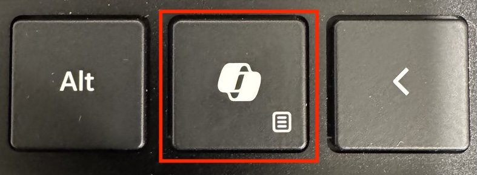
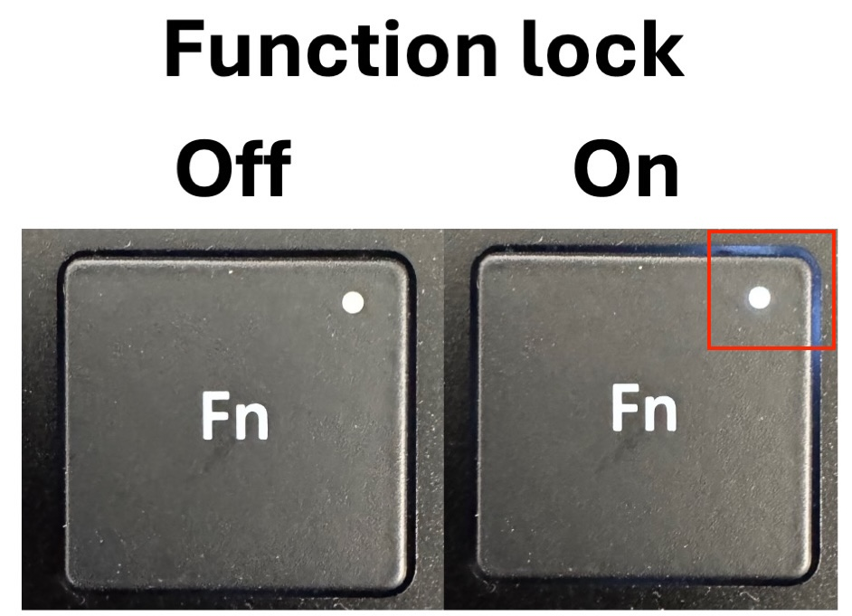
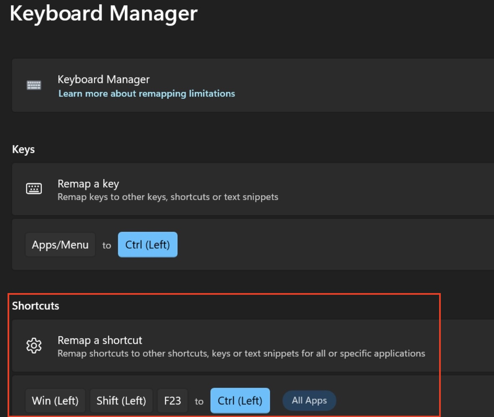
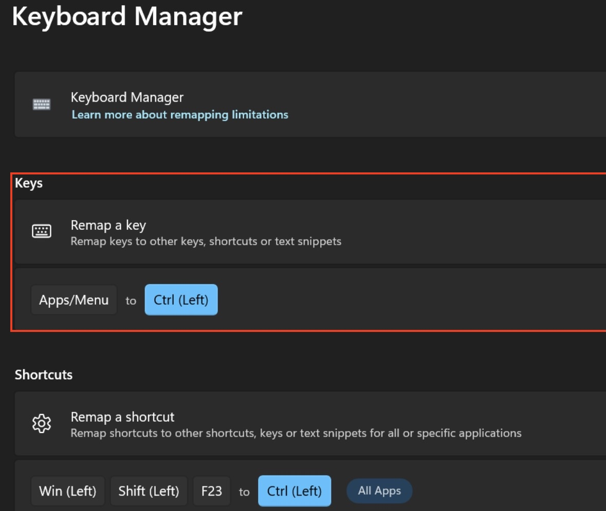

+++
title = "How to remap the copilot key to ctrl"
hook = "How to remap the Copilot key to work as a ctrl key using PowerToys"
image = "copilot.png"
published_at = 2026-03-15T17:46:06-07:00
tags = ["Windows", "Programming"]
youtube = ""
+++

## What exactly is the Copilot key?

The Copilot key actually sends a combination of **three keys** to the OS when the function lock is off!!

```txt
Win (left) + Shift (left) + F23
```

When the **function lock is on**, the Copilot key only sends **one** keystroke to the OS:

```txt
Apps / Menu
```

So in order to comprehensively remap the Copilot key back to ctrl, you actually need two things:

1. A PowerToys shortcut
2. A PowerToys remap


*The infamous Copilot key*


*The funciton lock key*

## Adding a PowerToys shortcut

The Copilot key sends `Win + Fn + F23` to the OS when the function lock is off. 

We can intercept this in [**PowerToys Keyboard Manager**](https://learn.microsoft.com/en-us/windows/powertoys/) by adding a shortcut remapping.

*This shortcut accounts for when function lock is off on your keyboard, and re-maps the copilot key to just ctrl*

## Adding a PowerToys key remapping

When Function Lock is **on**, the Copilot key sends `Apps/Menu` to the OS. 

We need a separate key remapping in PowerToys to handle this case.


*This is the remap, for when function lock is turned on, on your keyboard*

## Conclusion

That's it! You just need these two things:

1. A PowerToys shortcut
2. A PowerToys remap

To fully remap your copilot key _back_ to ctrl 🙂
