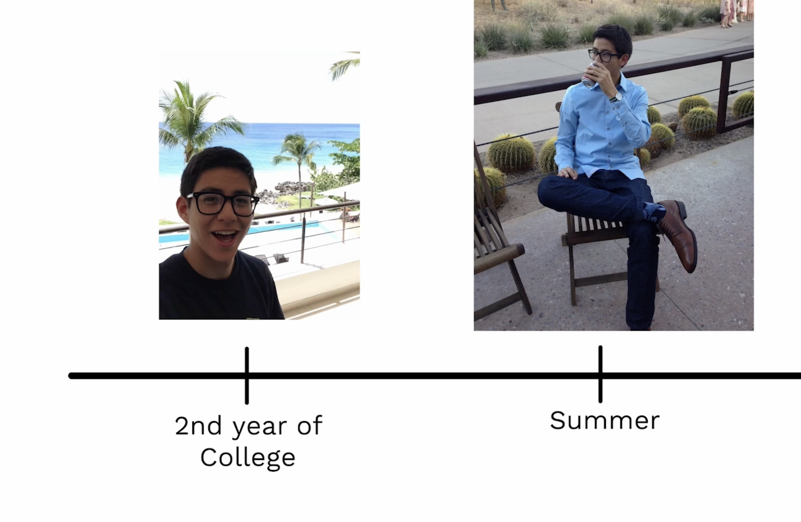
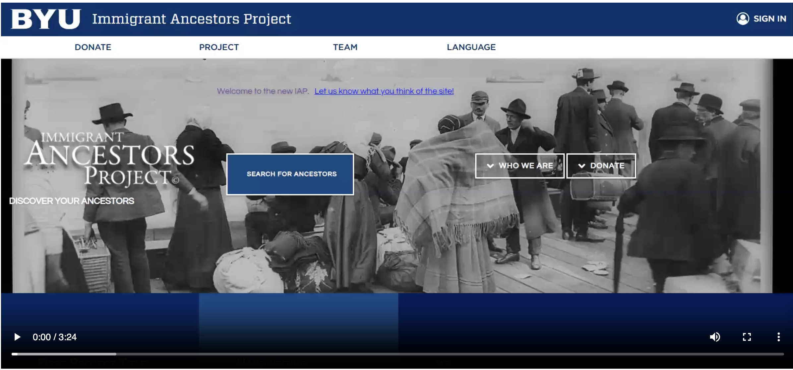
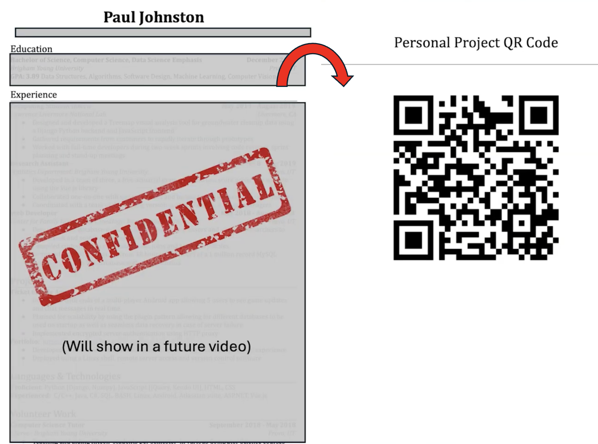
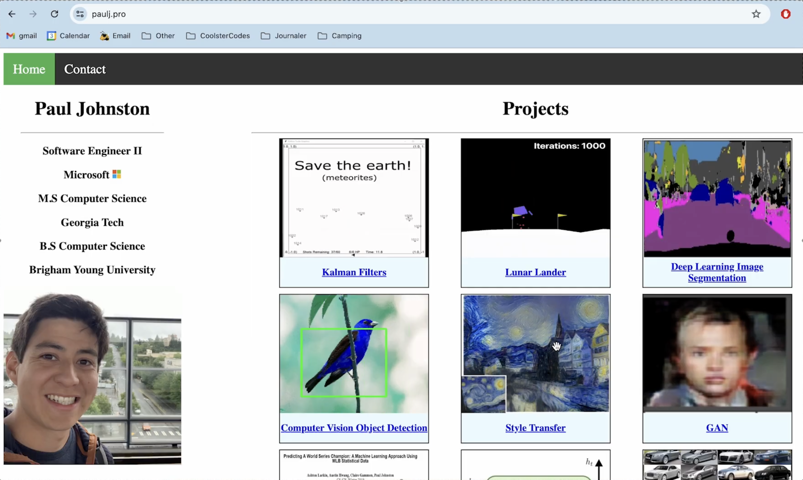

+++
title = "How I got a job at Microsoft!"
hook = "My Software Engineering journey!"
image = "./Thumbnail1.jpg"
published_at = 2025-10-02T19:20:09-06:00
tags = ["Microsoft", "Career"]
youtube = "https://youtu.be/Qtf2msivEW4"
+++

## Trying to land an internship

My sophomore year in college, I applied to a **BUNCH** of software engineering internships, in the hopes that I could land my first ever, real-world, internship

I of course, was rejected by all 😅  
I remember doing really bad on all of the interviews, and honestly just not really knowing my stuff yet  
One interview in particular went really bad, it was for Epic, the health-software company  
It was a grueling 4 hour online interview, which had things like trying to learn a new language there-and-then on the spot (they would tell you symbols/patterns for words, and you would have to remember them, and try and answer/form questions about them later 😂), which was insane  
I also had a bunch of phone screens, but yeah honestly I didn't do very well *yet*

*Naive little Paul, trying to get an internship*

Instead what I did, was apply as a web developer for the history department of my school  
And I got the job! ✅

## First real job

This Web Developer role at my school, REALLY helped me get some real-world software engineering experience.  
I remember having to actually solve hard problems, and working closely with clients (professors of the history department) to actually understand their needs, and build a website for them

You can check it out [here!](https://pjohnst5.github.io/projects/iap.html)

Anyways, this really helped me get ALOT more interviews for the next summer  
I remember in particular, migrating a database from MySQL to SQL (don't ask me why) REALLY helped solidify my experience for future recruiters in interviews (the DB had over 1 million records, and had to be transferred over in a 24hr window)

*The website that I helped build for my summer Web Developer role*

## Next summer internship search

In my junior year, I did a little hack 😏  
This was back when things were in person still, so I did a little something-something to my resume  
I put a QR code to my personal website I built, on the BACK of my resume, and when recruiters asked the typical "Tell me about yourself", I would just say "Flip that resume over and scan that QR code to see a website of all my achievements" and literal smiles would break out on their faces because it was finally something different from the routine thing they had heard from 100's of students that day 🙂

I believe I had 8-9 interviews come from this simple trick (and eventually, 3-4 internship offers) from places such as Pluralsight (really, really like this one and accepted, but then my family member got cancer and plans changed quickly), Lawrence Livermore National Lab, and Walmart (stopped with LucidChart since I already had one from Pluralsight I really liked)

*Putting a QR code of my website on the BACK of my paper-resume REALLY impressed recruiters!*

*My personal website at pjohnst5.github.io*

## Landing an internship!

*My summer internship project*

