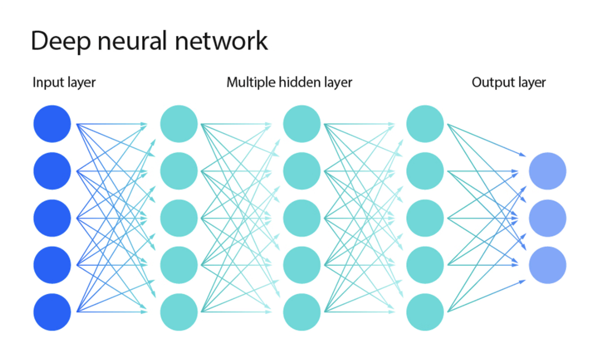

+++
title = "Knowledge-Based AI 2.0"
hook = "OMSCS has changed their Knowledge Based AI class"
image = "./kbai2.jpg"
published_at = 2026-01-15T13:06:45-07:00
tags = ["OMSCS", "AI"]
youtube = "https://youtu.be/R6nNAIY652M"
+++

## Big news

As of January 2025, in Knowledge-Based AI CS 7637, you now do [ARC-AGI](https://arcprize.org/arc-agi) instead of [Raven's Progressive Matrices](https://en.wikipedia.org/wiki/Raven%27s_Progressive_Matrices) as the final project

## Before: [Ravens progressive matrices](https://en.wikipedia.org/wiki/Raven%27s_Progressive_Matrices)

Before you would do this project called "Raven's Progressive Matrices"

It was a test made in 1936 to test intelligence in humans.

There was a lot of nuance to this. Mainly you had to delve into the code base the TAs wrote, and it was a pretty specific framework to just this OMSCS class (not across the industry at all)

There was also a part where you had to decide what colors to classify squares, which was a bit tedious, and just added minutia to the project.

With the new project, it is more clear cut and focused towards machine learning.

*Raven's Progressive Matrices, the project you used to do in this class*

## After: [ARC-AGI](https://arcprize.org/arc-agi)

This now is a much more standard measurement of AI capabilities across the industry

It also has a more standardized approach to input/output (no "Computer vision" part of it anymore)

It also has a more clear-cut approach to the problems, which allows you to focus on the AI task at hand.

Notice that in some of the problems, the output size of the grid is different than the input. This is intended. The output size is something your agent should be able to determine as well as which colors go where (kinda tricky!)

*ARC-AGI, the new frontier*

## What is allowed?

You are allowed to use machine learning packages for it, but not anything that readily solves the puzzles for it

For example, you could make a deep learning neural network, but not import a pre-made one, that has already been trained on these problems.

*An example of a deep neural network*

[Tensorflow](https://www.tensorflow.org/) and [Pytorch](https://pytorch.org/) are kind of the de facto industry standard libraries to use to build neural networks

## How does this impact the class overall?

I would say, it makes it even better [than before](../georgia-tech-omscs-knowledge-based-ai-cs-7637/)

ARC-AGI is a cool project, and honestly it's what researchers and companies are using today to measure their AI agents

You won't be expected to come up with an industry standard machine learning model right away, more of a simplified version, but still it is relavant.
