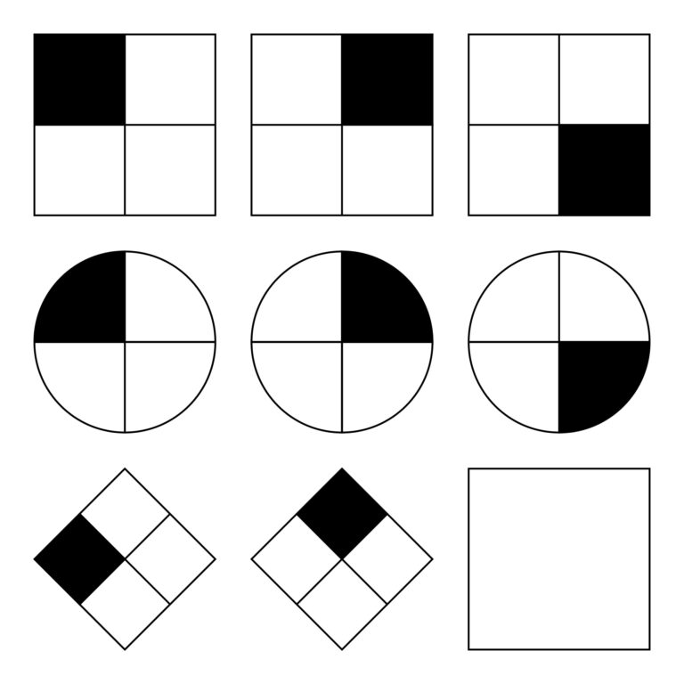
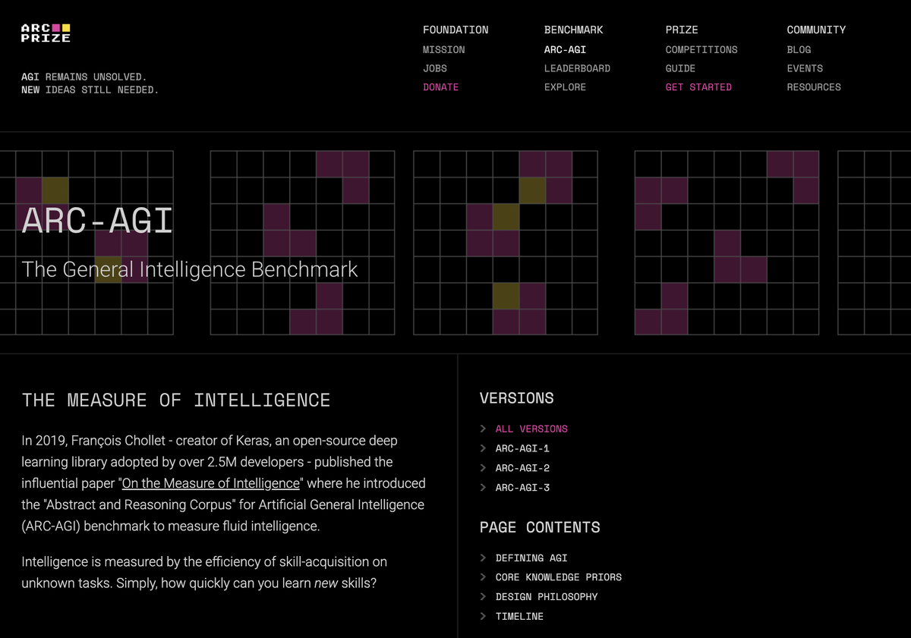

+++
title = "Knowledge-Based AI 2.0"
hook = "OMSCS has changed their Knowledge Based AI class"
image = ""
published_at = 2026-01-15T13:06:45-07:00
tags = ["OMSCS", "AI"]
youtube = ""
+++

## Big news

As of January 2025, in Knowledge-Based AI CS 7637, you now do a different final project than you did before.

## What was it before?

### Ravens progressive matrices

*The project you used to do in this class*

- Less well known
- Bit more specific format (not quite industry standard)
- More time spent separating pixels (there was more of "Computer Vision" aspect of it)

## What is it now?

### [ARC-AGI](https://arcprize.org/arc-agi)

*ARC-AGI, the new frontier*

This now is a much more standard measurement of AI capabilities across the industry

It also has a more standardized approach to input/output (no "Computer vision" part of it anymore)

## What is allowed?

You are allowed to use machine learning packages for it, but not anything that readily solves the puzzles for it

For example, you could make a deep learning neural network, but not import a pre-made one, that has already been trained on these problems.

## How does this impact the class overall?

I would say, it makes it even better

ARC-AGI is a cool project, and honestly it's what researchers and companies are using today to measure their AI agents

You won't be expected to come up with an industry standard machine learning model right away, more of a simplified version, but still it is relavant.
