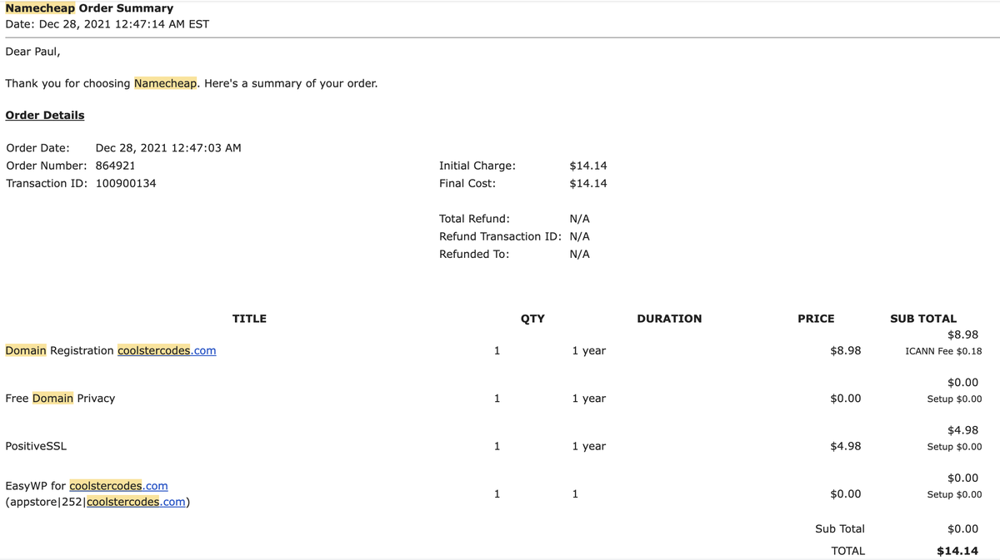
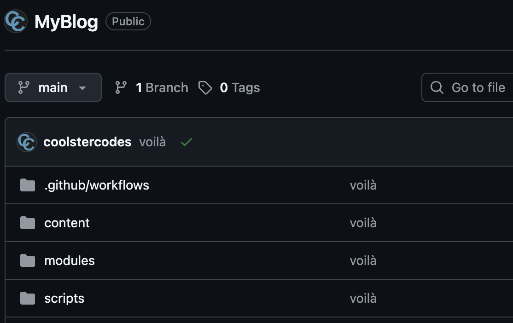
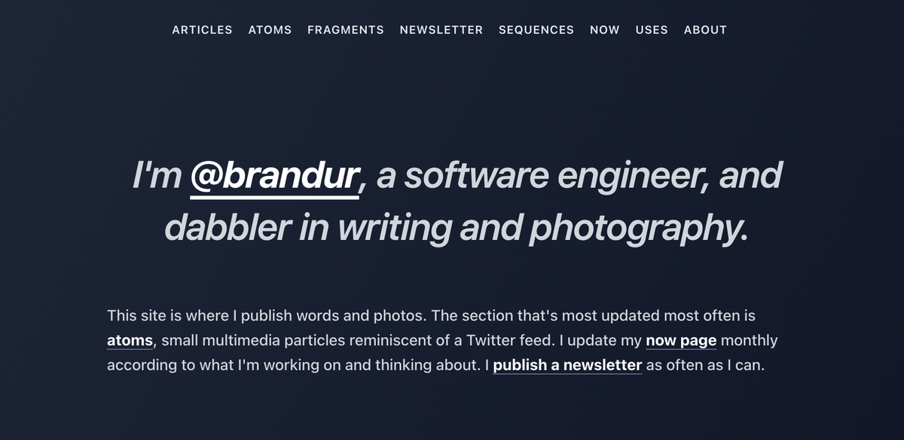
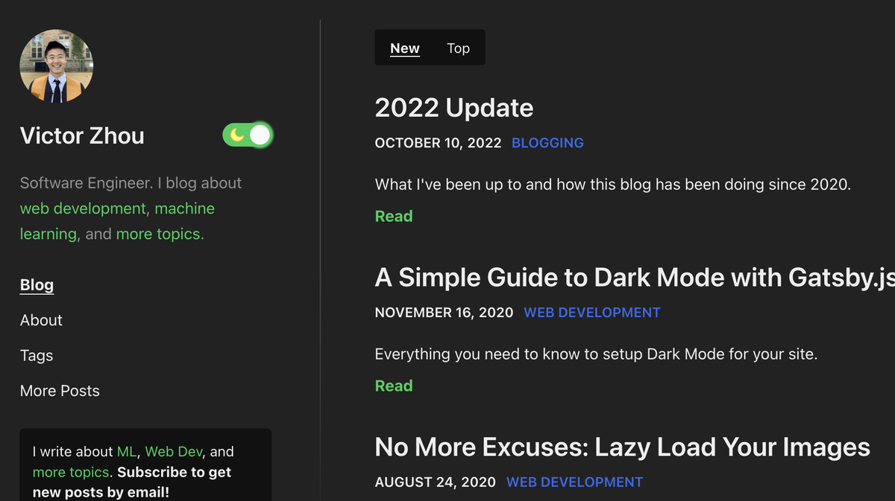
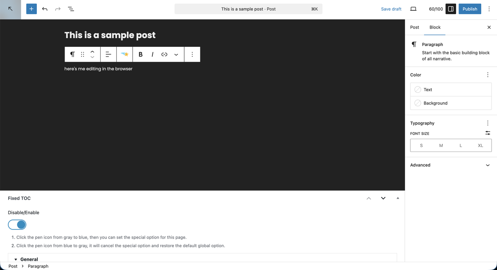
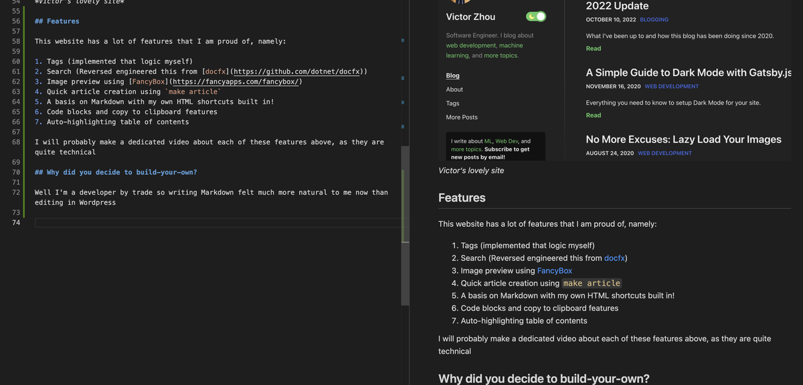

+++
title = "My blog"
hook = "All about this blog you are reading right now"
image = ""
published_at = 2025-11-25T19:50:10-07:00
tags = ["Blog", "Life", "Programming"]
youtube = "https://youtu.be/olfTsjbafGU"
+++

## When did this start?

I officially created my blog **December 28th, 2021**

*Me beginning this mixed up tale*

*My new caption*

I originally used [EasyWP](https://www.namecheap.com/wordpress/) using [WordPress](https://wordpress.com/) through [Namecheap](https://www.namecheap.com/)

WordPress is a great way to get a site up and running with minimal effort, it really just becomes about [hosting](https://en.wikipedia.org/wiki/Web_hosting_service) after that

I really wanted a way to just quickly get my ideas down and not have to think about the nuances of coding my own website (although I had already [done that](https://pjohnst5.github.io) before)

## How did you build this?

Now I use.. MY OWN CODE to make my website!

*The beautiful [code](https://github.com/pjohnst5/CoolsterCodes)*

I must give a lot of credit to [brandur](https://github.com/brandur/sorg) for creating his own and making it open-source!!

I totally just took that, and rolled with it

*Brandur's lovely site*

I also did take great inspiration from [Victor Zhou's](https://victorzhou.com/) blog which looks very aesthetically pleasing and has tags ([yoinked](https://github.com/pjohnst5/CoolsterCodes/pull/32) that feature for myself)

*Victor's lovely site*

## Features

This website has a lot of features that I am proud of, namely:

1. Tags (implemented that logic myself)
2. Search (Reversed engineered this from [docfx](https://github.com/dotnet/docfx))
3. Image preview using [FancyBox](https://fancyapps.com/fancybox/)
4. Quick article creation using `make article`
5. A basis on Markdown with my own HTML shortcuts built in!
6. Code blocks and copy to clipboard features
7. Auto-highlighting table of contents
8. CI/CD through Github Actions and integration with Azure 😎

I will probably make a dedicated video about each of these features above, as they are quite technical

## Why did you decide to build-your-own?

Well I'm a developer by trade so writing Markdown felt much more natural to me now than editing in Wordpress

* The WordPress way of doing things (too many buttons 🤮) *

* The Markdown way of doing things (so simplified 😇) *

Also cost was a factor, here's a breakdown of the cost of both ways

| Feature | EasyWP | Markdown |
|---------|--------|----------|
| Domain Name | $20 | $20 |
| Hosting | $50/year | Free! 🤩 |
| Editing Experience | Editing in browser 🤮 | Writing Markdown 😇 |
| Search | Search was very basic and not responsive | Wicked fast search and super usable ⚡️ |
| Configuration | Hard to configure / have to pay for certain plugins | Can change anything I want fairly straightforwardly |
| Learning | Don't learn as much about how websites work and what is even available to change | I know this website inside and out now |
| Speed | Convenient / fast | Takes a while |

## Why did you start a blog?

I originally started because I wanted to make a programming tutorial, about how to [build a docker image using windows nanoserver as base](../docker-nanoserver-base-image-windows/).

At the time, Windows pods were still pretty new, and it was pretty hard to find all the _exact_ info out there about how to mount a configmap into one, on Windows.

I figured it out and just really wanted to make a cool blog such as [ComputerHope](https://computerhope.com) (which, btw is from my hometown of Salt Lake City let's go BABY! 🙌🏼)

You can even tell from ComputerHope that my color scheme is quite similar, I really liked that look and wanted my own site where I could put my ideas.

My first tutorial on this site!
