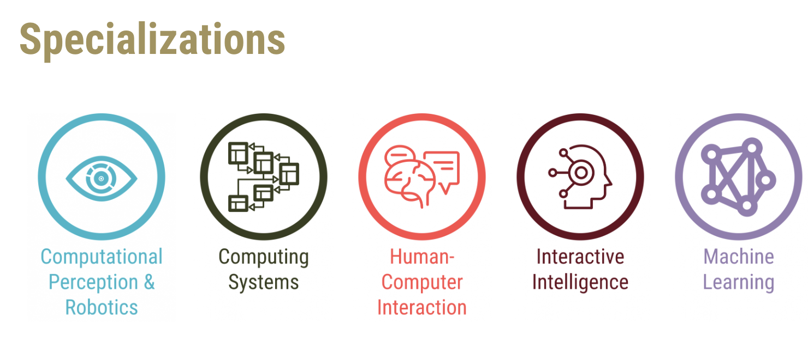

+++
title = "OMSCS: Which Specialization Should You Choose?"
hook = "Helping you choose the right OMSCS specialization"
image = "spec3.jpg"
published_at = 2024-10-05T20:09:00-06:00
tags = ["OMSCS"]
youtube = "https://youtu.be/0R-XlpVCoM0"
+++

## OSMCS: Which Specialization Should You Choose?

There are two schools of thought:

1. Get a degree as fast as you can (in which case, I suggest Interactive Intelligence)
2. Learn something specialized (ML, Robotics, HCI, etc.)

Either way, there’s a general way you’ll want to go about this, which is, see which classes fulfill multiple specializations your interested in:

*Classes that overlap*

One thing you’ll want to make sure is, you don’t re-do too many class requirements from the specializations list:

*The OMSCS specializations*

## Hey this is a nother title

And then some text, maybe a list

- What is in a name
- Hey
