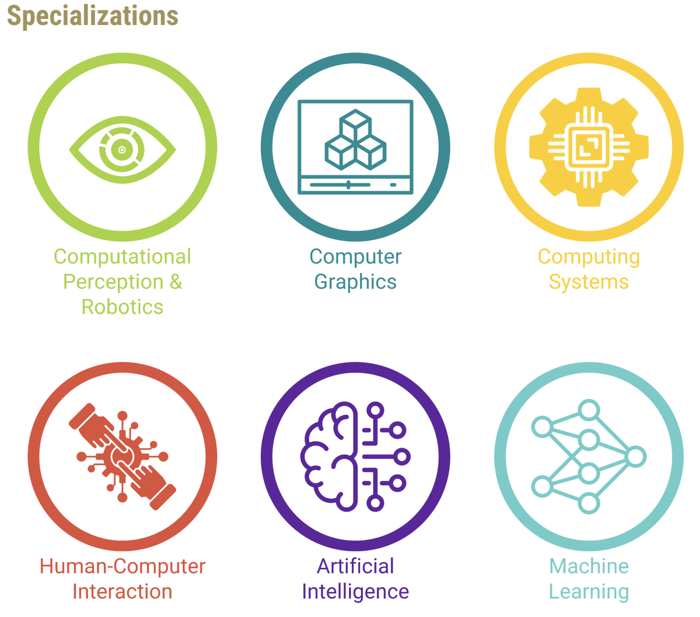
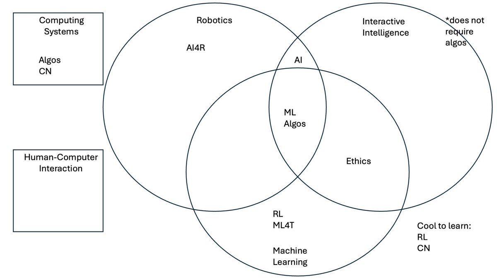

+++
title = "OMSCS Which Specialization Should You Choose?"
hook = "Choosing the right OMSCS specialization for you"
image = "./spec3.jpg"
published_at = 2024-10-05T15:47:41-07:00
tags = ["OMSCS"]
youtube = "https://youtu.be/0R-XlpVCoM0"
+++

## The 5 (now 6) specializations

*The 6 specializations for the OMSCS as of Fall 2025*

- Computer graphics is new as of Fall 2026 (see the sneak peak into this from [my interview with Dr. Joyner](https://youtu.be/FyUmqKmt1kA))

## Criteria

1. How soon do you want to be done with the program?
2. What do you want to learn?
3. Are you willing to take Grad Algos? 😈

## Groupings

One of the best tricks you can do, is "group" together certain specializations.  
This means that when you take a class, it usually can count towards multiple different specializations (if you are not sure yet which you want to do).  
Start with these classes, as it frees up your time later, to specify into one specific specialization

*Overlapping classes and specializations*

Take for example [**CS 6601 Artifical Intelligence**](../georgia-tech-omscs-artificial-intelligence-review-cs-6601/)  
It can count towards both the **Artifical Intelligence** specialization AND the **Interactive Intelligence** specialization.  
So it is a good one to start with

[**CS 7641 Machine Learning**](../georgia-tech-omscs-machine-learning-review-cs-7641/) falls under the **Robotics**, **AI** and **Machine Learning** specializations

So that is a good one to take if you are completely unsure which specialization you want (though it is hard, read [my review](../georgia-tech-omscs-machine-learning-review-cs-7641/)) on it

## Can I switch later?

Yes, you can

It is relatively easy to switch specializations actually

All you need to do, is go to Georgia Tech's online portal, and select which specialization you want from a drop down menu (I do not have access anymore but this was literally the click of a few buttons for me)

You can do it I believe, up until the semester before you graduate

## Grad algos!

For these specializations, you **MUST** take [**CS 6515 "Introduction" 😂 to Graduate Algorithms**](../georgia-tech-omscs-graduate-algorithms-review-cs-6515/)

- Machine Learning
- Computing Systems
- Robotics
- Computer Graphics

For these specializations however, it is **NOT required**

- Artifical Intelligence
- Human-Computer Interaction

This class is hard, so be thinking about the fact it might set you back 1 semester from graduating (it did to me)

## Robotics

A solid specializations that requires grad algos, so beware

The AI 4 robotics class is super cool though

## Interactive Intelligence (now Artificial Intelligence as of 2025)

A very solid option, you don't have to take Grad Algos and it is not too hard (but you learn a lot)

## Machine Learning?

[**CS 7641 Machine Learning**](../georgia-tech-omscs-machine-learning-review-cs-7641/) is more of an introductory course into Machine Learning, and you do not need to know alot about it beforehand to be successful in it

That being said, it is pretty tedious, and the grading can be harsh

I myself got a **40%** in that class, but it still got me a **B**

So don't be too worried if you are bombing your assignments (there is a super heavy curve)

## Computing Systmes

Check out my [interview with someone](../omscs-computing-systems-specialization-interview/) who did this specialization!

It is a solid option honestly, very practical, you'll always need these skills in the industry no matter your trade

## Human-Computer Interaction

This is a very non-technical specialization. You do not need to do a lot of coding to get it done.

You can see my interview with [someone who did the HCI specialization](../georgia-tech-omscs-human-computer-interaction-review-cs-6750/)

## Great starter classes!

[CS 7646 Machine Learning for Trading](../georgia-tech-omscs-machine-learning-for-trading-review-cs-7646/) is honestly a great first class to take. It fits only into the Machine Learning specialization but is still a great starter course

[CS 7638 Artificial Intelligence Techniques for Robotics](../georgia-tech-omscs-ai-for-robotics-review-cs-7638/) is also a great starter course, though it also only fits into the Robotics specialization. However, you do learn Numpy a lot in that class which translates to several classes later on

[CS 7637 Knowledge-Based AI](../georgia-tech-omscs-knowledge-based-ai-cs-7637/) is my personal favorite for a starter class. You code an AI agent, numpy alot and it generally speaking prepares you pretty well for future classes
