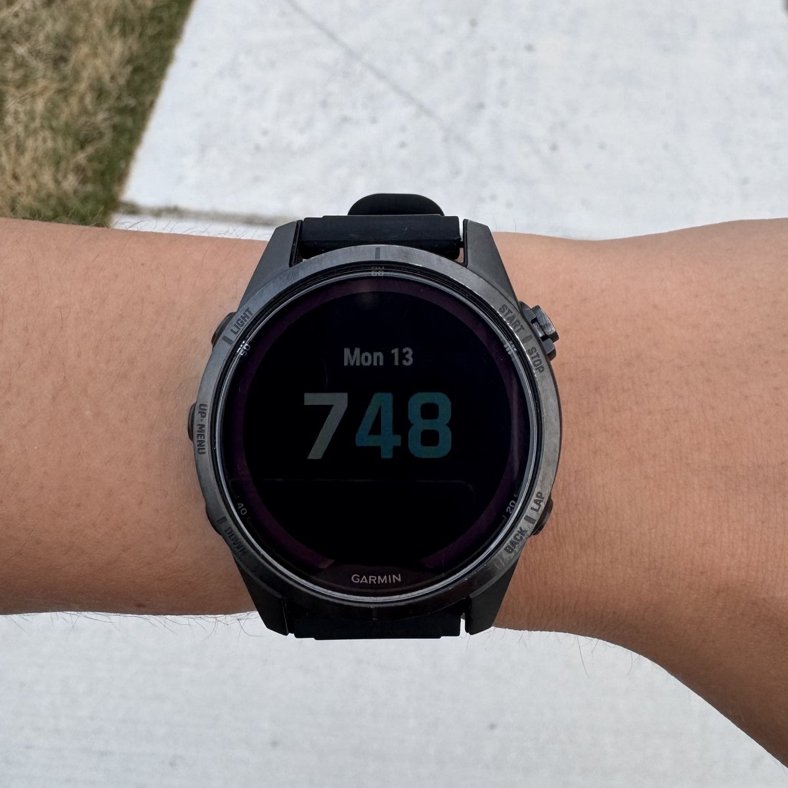
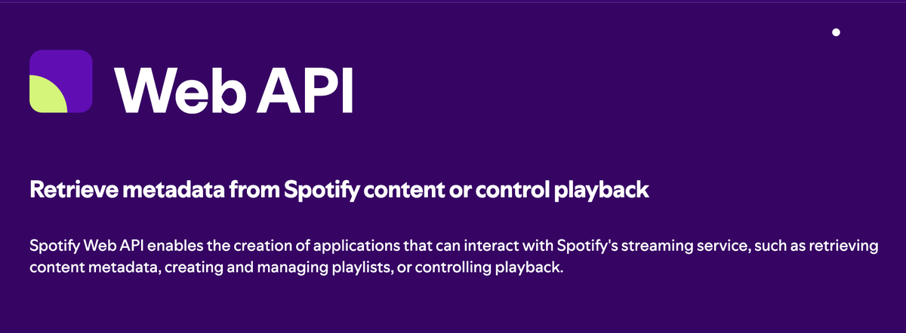
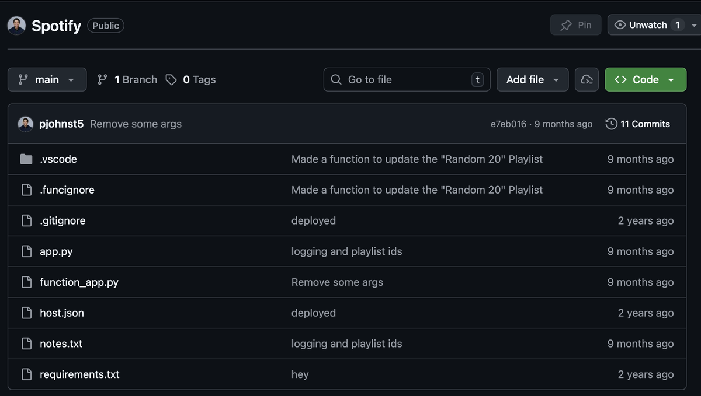
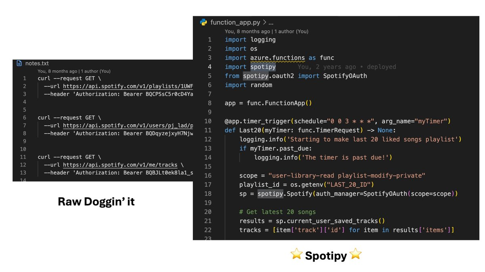
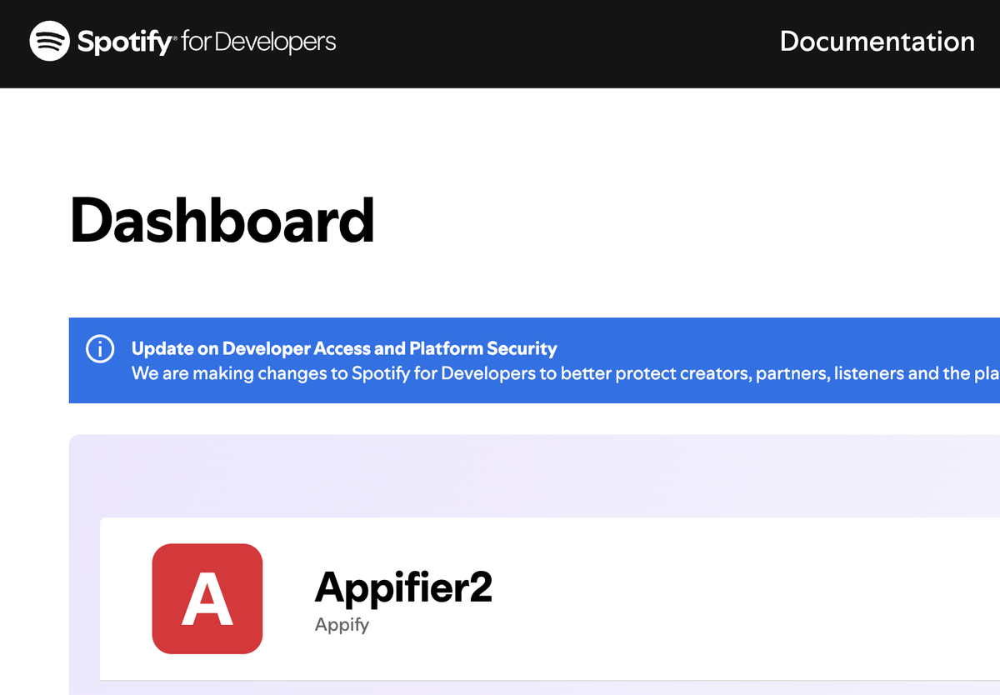
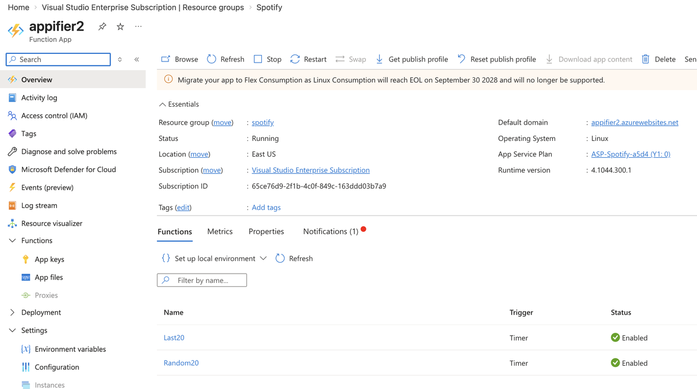
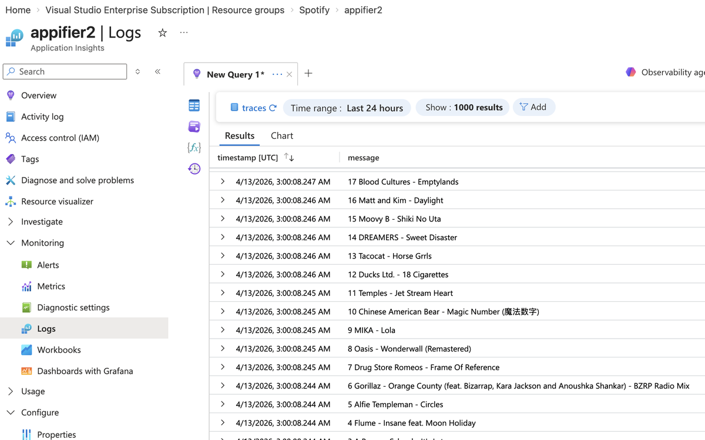
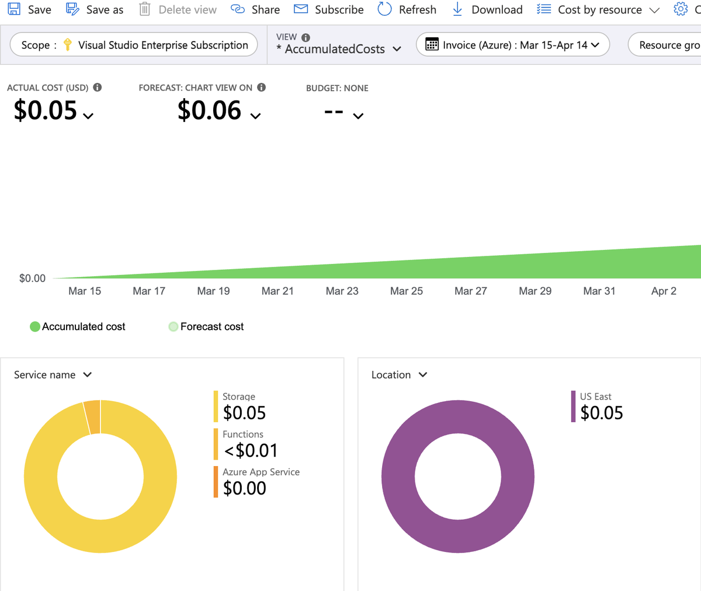
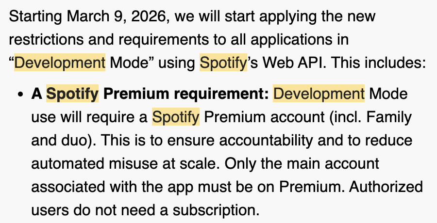

+++
title = "How to Program Spotify!"
hook = "Make playlists automatically"
image = "spotify_logo.png"
published_at = 2026-04-13T19:11:54-06:00
tags = ["Music", "Spotify", "Programming"]
youtube = ""
+++

I have a very particular use case where on my Garmin watch that can have up to **2,000** songs downloaded onto it from Spotify.

Here's the catch: **Syncing** that many songs regularly is MASSIVE, and takes forever.

Plus, I usually don't even get CLOSE to listening to that many songs while running. Maybe like 10-20 AT MOST.

So, here's the catch: I want to program a playlist or two, that update periodically to my watch, that are just samples of other playlists.

*My beautiful Garmin Fenix 7S Pro Sapphire Solar watch!! 😱*

## Playlists

- "Random 20" (A playlist of only 20 random songs from my liked songs, that updates once a day)
- "Last 20" (My most recently liked 20 songs, also updated every day)

## Spotify API

Spotify has an API that let's you **code** your playlists [1] 😂 (My brother would be teasing me so bad right now)

*The beloved [Spotify API](https://developer.spotify.com/documentation/web-api)*

## GitHub

Here is the GitHub repository for this project.

Feel free to clone it and go!!

*The beautiful [source code](https://github.com/pjohnst5/Spotify)*

## Walkthrough of the code

So here's the deal, you could make raw API request to Spotify if you wanted to using any computing language you wanted, but that is quite verbose and unwieldy. There's a nice python package called Spotipy which lets you do this in python very easily.

*Raw `curl` requests to Spotify's API vs Spotipy*

Here's a walkthrough of the code:

- `Lines 1-6` are importing our functions and dependencies that we need.
- `Line 8` is creating a new Azure Function App instance.
- `Line 10` is the way you trigger a run of your function app using cron job notation. Notice the `0 7 * * *` means that on the `7th` hour of every day I want this to run, which happens to be midnight my local time.
- `Lines 12-14`, I don't really know what they are, to be honest; just some boilerplate code I found from Azure Functions.
- `Line 16`, though, is the way you want to read your Spotify library.
- `Line 17` is how I'm getting the ID of the playlist I want to alter as an environment variable. I've just saved it in my Azure function as an environment variable.
- `Line 18` is making a new Spotipy instance.
- `Line 21` is getting the most recently liked songs. By default it gets the last `20` songs, so I don't have to pass in any number there; it just does `20` by default. I then pull out the names and the ID of each one so that on line `25` I can just replace the playlist I want with those `20` tracks. I then just for loop through each one to print them off so I know which ones actually got transferred over.

## Getting a client-id

First you have to get a client-id by registering an app with Spotify. I think you only get one per account unless you pay more or something, but essentially it's letting the app act on your behalf and alter your Spotify library for you if you allow it (the first time you run the app, it will prompt you to allow the app to alter your Spotify account)

*My first Spotify app*

## Deployment

This code runs once a day, on an [Azure Function](https://azure.microsoft.com/en-us/products/functions) in cron-job type fashion

*The Azure Function App running my python code every day*

## Monitoring

This Azure Function App prints its logs to an Azure Application Insights

*Example run of this app*

## Cost breakdown

This only cost **$0.05** per MONTH! 😱

[1] Now Spotify makes you have a "Premium" account to do this, but before it used to be possible with a free account

*Spotify being Spotify*

